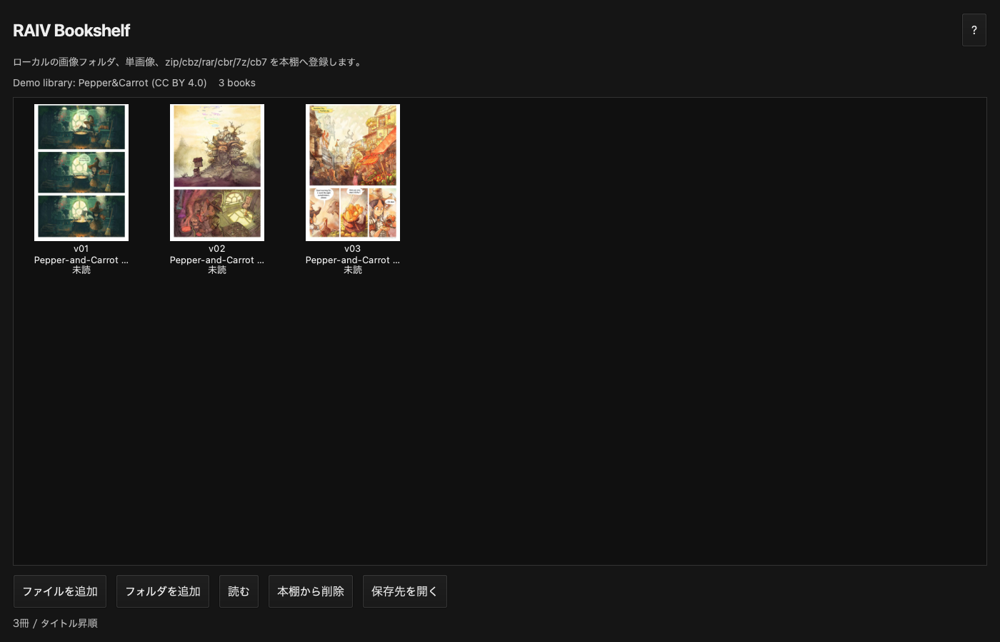
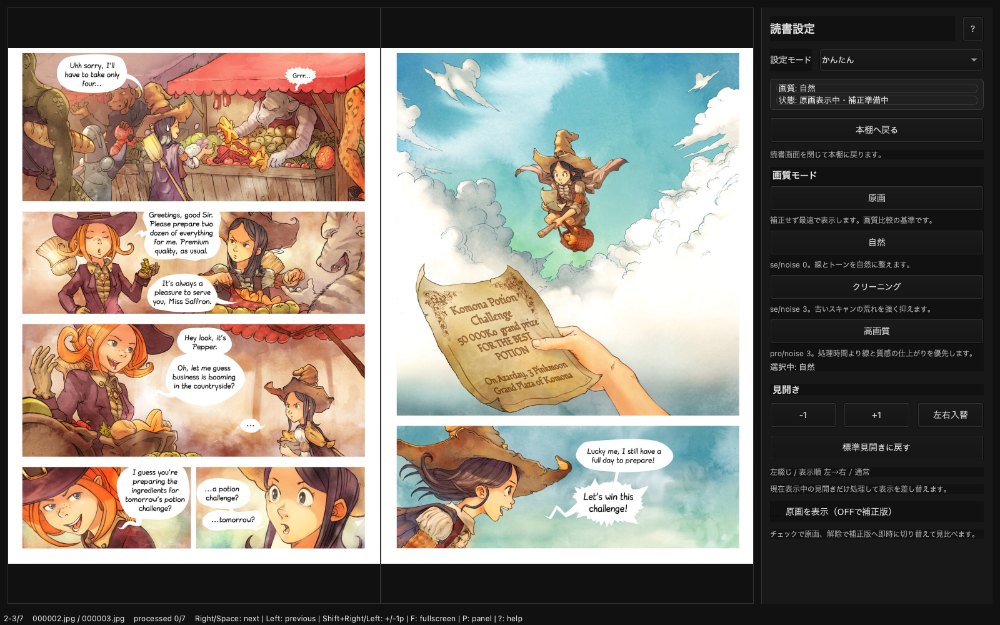

# RAIV for mac

[English](README.md) | [日本語](README.ja.md)





スクリーンショットと`demo`の画像はDavid Revoy氏の*Pepper&Carrot*を
[CC BY 4.0](demo/ATTRIBUTION.md)に基づいて使用しています。商業漫画の画像は含みません。

RAIV for mac は、Apple Silicon Mac向けの画像・漫画ビューアです。本棚へ漫画を登録し、右綴じの見開き表示とReal-CUGANによるAI補正を使って読めます。

[nalltama/RAIV](https://github.com/nalltama/RAIV)の思想と配布方式に敬意を払い、macOS向けに独立実装しています。本家RAIVの公式リリースではありません。

## すぐに使う

一般ユーザーにPython、uv、ターミナル操作は不要です。

1. [Releases](https://github.com/jydie5/RAIVformac/releases)を開きます。
2. `RAIVformac-v0.2.0-alpha-macos-apple-silicon-standalone.zip`をダウンロードします。
3. ZIPをダブルクリックして展開します。
4. `RAIV.app`を`アプリケーション`フォルダへ移動します。
5. 初回だけ`RAIV.app`をControlキーを押しながらクリックし、`開く`を選びます。

詳しい画面説明と起動できない場合の対処は[INSTALL.ja.md](INSTALL.ja.md)にあります。

> 現在のα版は署名・Apple notarization未実施です。初回の通常ダブルクリックはmacOSに止められることがあります。

## 最初の一冊を読む

1. RAIVを起動すると本棚が開きます。
2. ZIP、CBZ、RAR、CBR、7z、CB7、または画像フォルダを本棚へドラッグ＆ドロップします。
3. 確認画面で`登録`を選びます。
4. 表紙をダブルクリックすると読書画面が開きます。
5. 左カーソルキーまたはSpaceで先へ進みます。

元の圧縮ファイルは削除しません。本棚には読書用に展開したコピーを保存します。

## AI補正と原画比較

standalone版には、公式の`realcugan-ncnn-vulkan 20220728 macOS`実行ファイルとモデルを同梱しています。追加セットアップは不要です。

- 読書中は現在の見開きと前後のページをバックグラウンドで自動補正します。
- 読む速さに応じて前方12〜24ページ、後方4ページを循環保持します。
- `P`キーで読書設定を開きます。
- `原画を表示（OFFで補正版）`をONにすると原画、OFFにすると補正版です。
- `状態: 補正済み`になる前は、切り替えても同じ原画が表示される場合があります。
- 縦2234px以上の画像は標準設定では補正を省略します。

補正処理はApple Silicon GPUをVulkan/Metal経由で使用します。補正を待っている間も原画で読み進められます。

## 画質モード

通常は`かんたん`モードで次の4種類から選びます。

| モード | 用途 |
|---|---|
| 原画 | 補正せず元画像を表示 |
| 自然 | 線とトーンを自然に整える標準設定 |
| クリーニング | 古いスキャンや圧縮荒れを強めに抑える |
| 高画質 | 処理時間より仕上がりを優先 |

`マニュアル`へ切り替えると、モデル、倍率、noise、tile、TTA、補正スキップ解像度を変更できます。調整した組み合わせには名前を付けて保存し、次回起動後も呼び出せます。

## 主な機能

- 表紙を並べる本棚
- 複数アーカイブのドラッグ＆ドロップ登録
- ZIP/CBZ、RAR/CBR、7z/CB7、画像フォルダ
- 右綴じ漫画の表紙単独・見開き表示
- 巻順の並び替えと次巻への移動
- 読書位置の保存
- 全画面表示と透過進捗オーバーレイ
- Real-CUGANの自動先読み補正
- 読書速度に応じた適応先読み
- 非同期画像デコードと原画フォールバックによる即時ページ送り
- かんたん／マニュアル画質設定とカスタム設定保存
- 原画と補正版の即時切り替え
- 本棚からの削除と保存先表示

開発中の機能、既知の改善項目、実装順は[ROADMAP.md](ROADMAP.md)で確認できます。

## キーボード操作

右綴じ漫画の標準設定です。

| キー | 動作 |
|---|---|
| `←` / `Space` | 次の見開き |
| `→` | 前の見開き |
| `Shift + ←` | 1ページ先へずらす |
| `Shift + →` | 1ページ前へずらす |
| `F` | 全画面 |
| `P` | 読書設定の表示／非表示 |
| `?` | ショートカット一覧 |
| `Esc` | 全画面解除／本棚へ戻る |

## 保存場所

- 本棚データ: `~/RAIV Library`
- AI補正キャッシュ: `~/Library/Caches/RAIV`
- 本棚データベース: RAIVのApplication Support領域

元のZIP/RARは取り込み後も元の場所に残ります。本棚から削除するとRAIVが作った展開済みコピーと読書状態を削除します。

## アンインストール

1. `RAIV.app`をゴミ箱へ移動します。
2. 本棚も不要なら`~/RAIV Library`を削除します。
3. 補正キャッシュも不要なら`~/Library/Caches/RAIV`を削除します。

元のZIP/RARはRAIVのアンインストールでは削除されません。

## 現在の制限

- Apple Silicon Mac専用です。
- 署名・Apple notarization未実施です。
- α版のためUIと設定の互換性が変わる可能性があります。
- RAR形式によってはmacOS側の展開機能との相性で開けない場合があります。
- 自動アップデートは未実装です。新しいZIPをReleasesから取得してください。

## ソースコードから起動する

この項目は開発者向けです。一般ユーザーはstandalone版を利用してください。

```bash
git clone https://github.com/jydie5/RAIVformac.git
cd RAIVformac
uv sync --extra gui
uv run raiv-viewer
```

Python不要のローカルアプリを作る場合:

```bash
uv sync --extra app
uv run --extra app python scripts/build_macos_app.py --bundle-engine
```

ビルド時に公式Real-CUGAN macOS ZIPをGitHub Releasesから取得し、SHA256を検証してから同梱します。ローカルの未知のバイナリは使用しません。

開発用テスト:

```bash
uv sync --extra dev
uv run pytest
```

## ライセンス

RAIV for mac本体はMIT Licenseです。同梱するReal-CUGANと依存物の由来、バージョン、ライセンスは[THIRD_PARTY_NOTICES.md](THIRD_PARTY_NOTICES.md)に記載しています。standaloneアプリ内にもライセンス全文を収録します。

## 自由ライセンスのデモ本

[`demo`](demo)には、本棚へそのままドロップできる小さなZIPを3冊収録しています。
David Revoy氏による*Pepper&Carrot*第1〜3話の英語・低解像度版で、各ZIP内にも
作者名、出典、CC BY 4.0の表示を収録しています。
